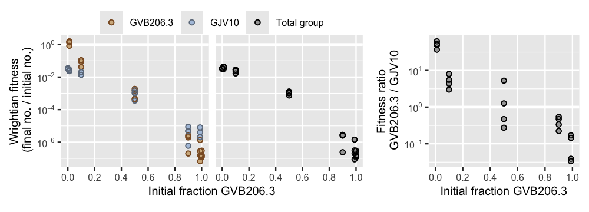

<!-- README.md is generated from README.Rmd. Please edit that file -->

```{r, include = FALSE}
knitr::opts_chunk$set(
  collapse = TRUE,
  comment = "#>",
  fig.path = "man/figures/README-",
  out.width = "100%"
)
```

<!-- badges: start -->
[](https://github.com/matryoshkev/mixexptr/actions/workflows/R-CMD-check.yaml)
<!-- badges: end -->

A common experimental design when studying microbial interactions is to mix together two different microbes (different genotypes, for example) then measure how their fitness and behavior depends on mix frequency. How do they behave differently together compared to on their own? 

`mixexptr` is an R package that provides tools to **calculate and plot the fitness effects of microbial interactions**, helping researchers get the most out of their data. 

## Calculate fitness effects

`mixexptr` provides a convenient way to calculate best-practice fitness measures that are:

* Robust across different species and types of interaction
* Well-suited to statistical analysis of effect sizes and confidence intervals
* Quantitatively comparable across studies and microbial systems
* Meaningful for both kin and multilevel selection theories of social evolution

```{r}
fitness_results <- calculate_mix_fitness(
	data_smith_2010, 
	population_vars = c(
		initial_number_A = "initial_cells_evolved",
		initial_number_B = "initial_cells_ancestral",
		final_number_A = "final_spores_evolved",
		final_number_B = "final_spores_ancestral"
	),
	strain_names = c("GVB206.3", "GJV10")
)
head(fitness_results)
```

## Plot fitness effects

`mixexptr` provides convenient ways to plot calculated fitness effects. Here's a quick diagnostic plot of the different fitness measures for this dataset: 
```r
plot_mix_fitness(fitness_results, mix_scale = "fraction")
```


## Installation

You can install the development version of `mixexptr` from [GitHub](https://github.com/) with:

``` r
# install.packages("devtools")
devtools::install_github("matryoshkev/mixexptr")
```

## Further reading

* smith j and Inglis RF (2021) Evaluating kin and group selection as tools for quantitative analysis of microbial data. Proceedings B 288:20201657. [https://doi.org/10.1098/rspb.2020.1657](https://doi.org/10.1098/rspb.2020.1657)

<!--
## Example

This is a basic example which shows you how to solve a common problem:

```{r example}
# library(mixexptr)
## basic example code
```

What is special about using `README.Rmd` instead of just `README.md`? You can include R chunks like so:

You'll still need to render `README.Rmd` regularly, to keep `README.md` up-to-date. `devtools::build_readme()` is handy for this.

You can also embed plots, for example:

```{r pressure, echo = FALSE}
# plot(pressure)
```

In that case, don't forget to commit and push the resulting figure files, so they display on GitHub and CRAN.
-->
