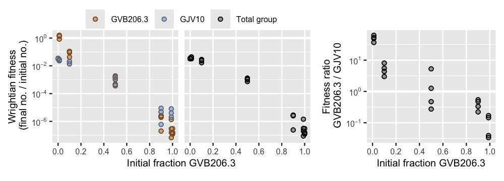

mixexptr - Analyze microbial interactions in mix experiments
================

<!-- README.md is generated from README.Rmd. Please edit that file -->
<!-- badges: start -->

[](https://github.com/matryoshkev/mixexptr/actions/workflows/R-CMD-check.yaml)
<!-- badges: end -->

A common experimental design for studying microbial interactions is to
mix together two different microbes (different bacterial genotypes, for
example) then measure how their fitness and behavior depends on mix
frequency. How do they behave differently together compared to on their
own?

`mixexptr` is an R package that provides tools to **calculate and plot
the fitness effects of microbial interactions**, helping researchers get
the most out of their data.

## Calculate fitness effects

`mixexptr` provides a convenient way to calculate best-practice fitness
measures that are:

-   Robust and quantitatively comparable across different species and
    types of interaction
-   Well-suited to statistical analysis of effect sizes and confidence
    intervals
-   Meaningful for both kin and multilevel selection theories of social
    evolution

``` r
fitness_results <- calculate_mix_fitness(
    data_smith_2010, 
    population_vars = c(
        initial_number_A = "initial_cells_evolved",
        initial_number_B = "initial_cells_ancestral",
        final_number_A = "final_spores_evolved",
        final_number_B = "final_spores_ancestral"
    ),
    strain_names = c("GVB206.3", "GJV10")
)
head(fitness_results)
#>     name_A name_B initial_fraction_A initial_ratio_A_B    fitness_A  fitness_B fitness_total
#> 1 GVB206.3  GJV10         1.00000000               Inf 1.200000e-07         NA  1.200000e-07
#> 2 GVB206.3  GJV10         0.98901099       90.00000000 1.555556e-07 0.00000400  1.978022e-07
#> 3 GVB206.3  GJV10         0.90000000        9.00000000 2.600000e-06 0.00000480  2.820000e-06
#> 4 GVB206.3  GJV10         0.50000000        1.00000000 4.280000e-04 0.00156000  9.940000e-04
#> 5 GVB206.3  GJV10         0.10000000        0.11111111 4.200000e-02 0.01400000  1.680000e-02
#> 6 GVB206.3  GJV10         0.01098901        0.01111111 8.420000e-01 0.02288889  3.189011e-02
#>   fitness_ratio_A_B
#> 1                NA
#> 2        0.03888889
#> 3        0.54166667
#> 4        0.27435897
#> 5        3.00000000
#> 6       36.78640777
```

## Plot fitness effects

`mixexptr` provides convenient ways to plot calculated fitness effects.
Here’s a quick diagnostic plot of the different fitness measures for
this dataset:

``` r
plot_mix_fitness(fitness_results, mix_scale = "fraction")
```



## Installation

You can install the development version of `mixexptr` from
[GitHub](https://github.com/) with:

``` r
# install.packages("devtools")
devtools::install_github("matryoshkev/mixexptr")
```

## Further reading

-   smith j and Inglis RF (2021) Evaluating kin and group selection as
    tools for quantitative analysis of microbial data. Proceedings B
    288:20201657. <https://doi.org/10.1098/rspb.2020.1657>

<!--
## Example

This is a basic example which shows you how to solve a common problem:


``` r
# library(mixexptr)
## basic example code
```

What is special about using `README.Rmd` instead of just `README.md`? You can include R chunks like so:

You'll still need to render `README.Rmd` regularly, to keep `README.md` up-to-date. `devtools::build_readme()` is handy for this.

You can also embed plots, for example:


In that case, don't forget to commit and push the resulting figure files, so they display on GitHub and CRAN.
-->
